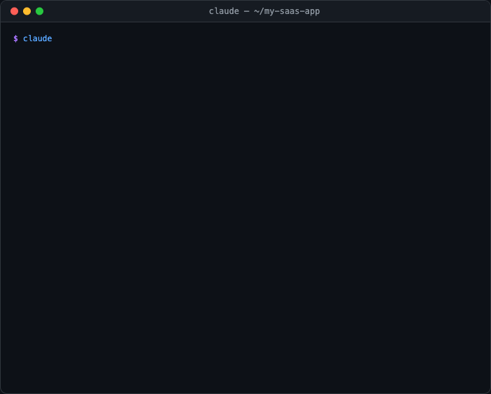

[English](README.md) | [繁體中文](README.zh-TW.md) | [日本語](README.ja.md) | [简体中文](README.zh-CN.md) | [Español](README.es.md) | [한국어](README.ko.md)

# 🎯 The Product Playbook

**World-class product planning AI Skill — from idea to development, one framework to rule them all**

[](https://opensource.org/licenses/MIT)
[](https://code.claude.com)
[](https://claude.ai)
[](http://makeapullrequest.com)

> Integrates the most impactful PM frameworks from Lenny's Podcast (Teresa Torres, Shreyas Doshi, Gibson Biddle, April Dunford, Todd Jackson, Marty Cagan, Richard Rumelt, and more) — turning AI into your senior product manager coach.

---

## ✨ What Is This?

The Product Playbook is a **Claude AI Skill** that systematically guides you through end-to-end product planning, from zero to one. It is not just a prompt — it is a complete interactive framework guidance system that includes:

- 🧭 **6 execution modes** — from 30-minute rapid validation to full-blown product plans (including a feature expansion fast track)
- 📐 **22 product frameworks** — covering the entire Discovery → Define → Develop → Deliver pipeline
- 🔄 **Change propagation engine** — modify any step and all downstream outputs update automatically
- 📎 **Smart file integration** — upload data, screenshots, or documents; the AI automatically integrates them into the relevant step
- 🔗 **Dev handoff** — generates CLAUDE.md + TASKS.md + TICKETS.md for seamless handoff to Claude Code development
- 📊 **Multi-format output** — HTML reports, PRDs, PowerPoint decks, dev handoff packages

**Trigger the entire flow with a single sentence:**

```
I want to build a product
```

---

## 🎬 Demo

<p align="center">
  
</p>

> The demo above shows **Build Mode**: describe your requirements → scan codebase → detect tech stack → apply frameworks for problem clarification, then jump straight into solution design.

---

## 🚀 Quick Start

### Option 1: Claude.ai Custom Skill

1. Download this repo as a zip file
2. Go to [Claude.ai](https://claude.ai) → Settings → Custom Skills
3. Upload the entire `the-product-playbook/` folder
4. Say "I want to build a product" in a conversation to trigger the skill

### Option 2: Claude Code Skill (Recommended)

> 💡 To update: simply re-run the install command to overwrite with the latest version.

| Method | Best for | Requirements |
|--------|----------|-------------|
| ① Copy & Paste | Beginners | Just open Claude Code |
| ② One-line install | Developers | Terminal |
| ③ Manual install | Custom paths | Terminal + git |

#### ① Copy & Paste Install (Easiest)

After launching Claude Code, paste the following and Claude will handle the installation automatically:

```
Please run the following commands to install (or update) the-product-playbook skill,
and tell me the result when done:

git clone https://github.com/kaminoikari/the-product-playbook.git /tmp/the-product-playbook
mkdir -p ~/.claude/skills ~/.claude/commands
cp -r /tmp/the-product-playbook ~/.claude/skills/the-product-playbook
cp /tmp/the-product-playbook/commands/* ~/.claude/commands/
rm -rf /tmp/the-product-playbook
```

#### ② One-line Install (Terminal)

```bash
# curl
curl -fsSL https://raw.githubusercontent.com/kaminoikari/the-product-playbook/main/install.sh | bash -s -- --lang en

# npx (requires Node.js)
npx the-product-playbook --lang en
```

Uninstall:

```bash
curl -fsSL https://raw.githubusercontent.com/kaminoikari/the-product-playbook/main/install.sh | bash -s -- --uninstall
# or
npx the-product-playbook --uninstall
```

#### ③ Manual Install

```bash
git clone https://github.com/kaminoikari/the-product-playbook.git
mkdir -p ~/.claude/skills ~/.claude/commands
cp -r the-product-playbook ~/.claude/skills/the-product-playbook
cp the-product-playbook/commands/* ~/.claude/commands/
```

Once installed, trigger in Claude Code:

```bash
# Main skill command
> /the-product-playbook

# Slash Commands (available after install)
> /product-quick I want to build an expense tracking app
> /product-full a pet social platform
> /product-revision redesign our e-commerce checkout flow

# Or natural language
> I want to plan a product
> Analyze my product using JTBD
> Help me plan an MVP
```

---

## 📦 File Structure

```
the-product-playbook/
├── SKILL.md                          # Core engine: mode definitions, step sequences, command system
├── LICENSE                           # MIT License
├── README.md                         # English README (this file)
├── README.zh-TW.md                   # Traditional Chinese README
├── assets/
│   └── demo.gif                      # README demo animation
├── commands/                         # Claude Code CLI Slash Commands (optional install)
│   ├── product-quick.md              # /product-quick — Quick mode
│   ├── product-full.md               # /product-full — Full mode
│   ├── product-revision.md           # /product-revision — Revision mode
│   ├── product-build.md              # /product-build — Build mode
│   ├── product-prd.md                # /product-prd — Generate PRD
│   ├── product-report.md             # /product-report — Generate HTML report
│   └── product-dev.md                # /product-dev — Generate dev handoff package
└── references/
    ├── 00-opportunity-check.md       # Opportunity assessment + DHM Model
    ├── 01-strategy.md                # Strategy Blocks + Rumelt + OKR
    ├── 02-discovery.md               # Persona + JTBD + OST + Journey Map
    ├── 03-define.md                  # Pain points + Positioning + HMW + Opportunity assessment
    ├── 04-develop.md                 # PR-FAQ + Pre-mortem + RICE + MVP + PRD
    ├── 05-deliver.md                 # North Star + PMF + GTM + Business model + Product spec
    ├── 06-html-report.md             # HTML planning report output spec
    ├── 07-dev-handoff.md             # Dev handoff: CLAUDE.md + TASKS.md + Architecture
    ├── 08-security-checklist.md      # OWASP Top 10 + CORS + CSP + Security architecture
    ├── rules-context.md              # Cross-session product context accumulation rules
    └── rules-*.md                    # Mode step rules + progress/change/file integration rules
```

---

## 🧭 Six Execution Modes

| Mode | Steps | Duration | Best for |
|------|-------|----------|----------|
| 🚀 **Quick Mode** | 3 steps | ~30 min | Rapid idea validation, pitch prep |
| 📦 **Full Mode** | 20 steps | Several hours | New product planning, major revamps |
| 🔄 **Revision Mode** | 12 steps | 1-2 hours | Iterating on existing products |
| ✏️ **Custom Mode** | 4-16 steps | Varies | Filling specific gaps |
| ⚡ **Build Mode** | 7 steps | ~1 hour | Problem is known, jump to solutions |
| 🔧 **Feature Expansion** | 4 steps | ~30 min | Adding a single feature to an existing product |

---

## 📐 Frameworks Included

### Understanding Users
| Framework | Creator | Purpose |
|-----------|---------|---------|
| JTBD (Jobs to Be Done) | Clayton Christensen | Uncover the real job users are trying to get done |
| Persona | — | Task/motivation-driven user archetypes |
| User Journey Map | — | End-to-end user experience mapping |
| Continuous Discovery | Teresa Torres | Weekly habit of talking to users |
| OST (Opportunity Solution Tree) | Teresa Torres | Systematically connect opportunities to solutions |

### Defining the Problem
| Framework | Creator | Purpose |
|-----------|---------|---------|
| Positioning | April Dunford | Competitive context and differentiation |
| HMW (How Might We) | — | Transform pain points into design challenges |

### Solution Design
| Framework | Creator | Purpose |
|-----------|---------|---------|
| Working Backwards / PR-FAQ | Amazon | Start from the customer outcome and work backwards |
| Pre-mortem | Shreyas Doshi | Predict and prevent failure before it happens |
| GEM Model | Gibson Biddle | Growth / Engagement / Monetization prioritization |
| RICE Scoring | Intercom | Quantitative feature prioritization |
| MVP Definition | — | Minimum viable product scoping |

### Strategy
| Framework | Creator | Purpose |
|-----------|---------|---------|
| Strategy Blocks | Chandra Janakiraman | Mission → Vision → Strategy hierarchy |
| Good Strategy Kernel | Richard Rumelt | Diagnosis → Guiding policy → Coherent action |
| DHM Model | Gibson Biddle | Delight / Hard to copy / Margin-enhancing |
| Empowered Teams | Marty Cagan | Empowered teams vs. feature teams |

### Measurement & Delivery
| Framework | Creator | Purpose |
|-----------|---------|---------|
| North Star Metric | Sean Ellis / Amplitude | Single metric representing core user value |
| Four-level PMF Framework | Todd Jackson | Assessing product-market fit |
| Sean Ellis Score | Sean Ellis | Quantifying PMF enthusiasm |
| GTM Strategy | — | Go-to-market launch and acquisition |
| Business Model & Pricing | — | Revenue model selection and value-based pricing |

---

## 🔑 Key Features

### 📎 Smart File Integration

Upload supplementary files at any step — the AI automatically identifies and integrates them:

| Upload | Auto-integrated into |
|--------|---------------------|
| Competitor screenshots | Positioning analysis |
| Interview transcripts | Persona + JTBD |
| User data CSV | Opportunity assessment + PMF evaluation |
| Market report PDF | Opportunity assessment + Strategy |
| Existing PRD | Revision mode + MVP |

### 🔄 Change Propagation Engine

Modify any upstream step and downstream outputs update automatically:

```
Modify JTBD → auto-updates HMW, Positioning, PR-FAQ, North Star, Product Spec Summary
Modify MVP  → auto-updates User Stories, DB Schema, Product Spec Summary
```

### 🔗 Dev Handoff

Generate a complete dev handoff package and kick off Claude Code development with a single command:

```
📦 Dev Handoff Package
├── CLAUDE.md          → Claude Code project memory
├── TASKS.md           → Feature breakdown + phased delivery
├── TICKETS.md         → Ticket list (ready for Jira/Asana/Linear)
├── docs/
│   ├── PRD.md         → Full PRD
│   ├── ARCHITECTURE.md → DB Schema + API + directory structure
│   └── PRODUCT-SPEC.md → Product spec summary
└── scripts/
    └── setup.sh       → One-click initialization script
```

```bash
# Start development in Claude Code with a single command
> Please read CLAUDE.md and TASKS.md, start executing Phase 0
```

### 🔥 Plan Directly on Existing Systems (Build Mode Killer Feature)

Launch **Build Mode** inside an existing project directory — Claude Code reads your codebase while doing product planning, effectively merging **product planning** and **technical feasibility assessment** into a single flow:

```
Your Existing Project                 Product Playbook
┌─────────────────┐                ┌─────────────────────┐
│ src/             │  ← auto-scan → │ Pre-mortem risk      │
│ db/schema.sql    │  ← auto-scan → │ MVP scoping          │
│ api/routes/      │  ← auto-scan → │ RICE prioritization  │
│ package.json     │  ← auto-scan → │ User Story breakdown │
│ CLAUDE.md        │  ← auto-scan → │ Dev handoff (delta)  │
└─────────────────┘                └─────────────────────┘
```

**Usage example:**

```bash
# 1. Navigate to your existing project
cd /path/to/your-existing-project

# 2. Launch Claude Code
claude

# 3. Use Build Mode and describe the feature you want to add
> /product-build I want to add real-time notifications to my existing system
```

Claude Code will automatically:
- Scan your directory structure, tech stack, and DB schema
- Run Pre-mortem based on your **real architecture** (not hypothetical risks)
- Generate MVP and User Stories that plug directly into existing modules
- Produce a dev handoff package as an **incremental plan**, not a greenfield build

> 💡 **Why is this powerful?** Traditional product planning and technical assessment are separate processes — PMs write specs, toss them to engineers, and engineers say "this can't be done." Build Mode grounds the planning process in real system constraints, eliminating the back-and-forth.

### 🔒 Security Built In

Dev handoff packages automatically include security architecture — no afterthought patching:

- **OWASP Top 10 checklist** — input validation, authentication/authorization, XSS/CSRF protection
- **Security architecture section** — CORS policies, CSP headers, rate limiting, API security middleware
- **.gitignore template** — auto-excludes `.env`, credentials, progress files
- **Pre-mortem security scenarios** — data breaches, account takeovers, API abuse as mandatory considerations

### 📦 Cross-Session Product Context Accumulation

Planning outputs are automatically saved to `.product-context.md` and loaded on the next session:

```
1st session (Full Mode) → saves Identity + Core Strategy + Architecture
2nd session (Feature Expansion) → auto-loads tech stack and modules, skipping redundant collection
3rd session (Revision Mode) → carries forward historical decisions and known pain points, focusing on deltas
```

### 🏢 Automatic B2B / B2C Adaptation

Once the product type is confirmed, frameworks auto-adapt:

| Aspect | B2C | B2B |
|--------|-----|-----|
| Persona | Individual motivation segmentation | Buyer + User dual Persona |
| PMF | DAU / Retention / Sean Ellis | Paying customers / NRR / NPS |
| North Star | Core action completion count | ARR / Net Revenue Retention |
| Aha Moment | Within first use | Onboarding / Time-to-Value |

---

## 📊 Quality Benchmark Results

By comparing response quality between "with Skill guidance" and "without Skill guidance" using automated AI grading, we quantify the real impact of the Skill.

### Four Iterations Compared

| Iteration | Test Items | With Skill Pass Rate | Without Skill Pass Rate | Delta |
|-----------|:--------:|:-------------------:|:----------------------:|:-----:|
| Iteration 1 (Baseline) | 6 | 100% | 57.4% | +42.6% |
| Iteration 2 | 6 | 100% | 63.3% | +36.7% |
| Iteration 3 | 6 | 94.1% | 38.2% | +55.9% |
| **Iteration 4 (Latest)** | **9** | **100%** | **31%** | **+69% ✅** |

### Iteration 4 Detailed Results (9 tests × 49 expectations)

| Test Item | With Skill | Without Skill | Delta |
|-----------|:--------:|:------------:|:-----:|
| Mode Selection (3-step progressive) | 100% | 0% | +100% |
| Quick Mode JTBD Analysis | 100% | 43% | +57% |
| JTBD Depth (B2B org-level) | 100% | 57% | +43% |
| PR-FAQ Writing | 100% | 33% | +67% |
| Revision Mode | 100% | 67% | +33% |
| Quality Self-check Hard Gate | 100% | 0% | +100% |
| **Feature Expansion Mode (New)** | **100%** | **17%** | **+83%** |
| **Security Integration (New)** | **100%** | **25%** | **+75%** |
| **Context Bootstrap (New)** | **100%** | **0%** | **+100%** |

### Key Findings

- **Quality Self-check Hard Gate** (+100%): Whether the AI proactively critiques its own output with strict standards, flags gaps, and demands improvement after completing a deliverable — 0% pass rate without the Skill
- **Context Bootstrap** (+100%): Whether the AI collects foundational product information before starting to plan, rather than jumping straight into technical implementation — completely skipped without the Skill
- **Feature Expansion Mode** (+83%): Whether the AI recognizes "adding a feature to an existing product" scenarios and activates a streamlined 4-step flow instead of the full 7-12 steps — without the Skill, it jumps straight to technical solutions
- **Security Integration** (+75%): Whether the dev handoff includes security architecture, .gitignore templates, and platform-specific security measures — without the Skill, security is reduced to a single summary table

> See [`evals/`](./evals/) for detailed methodology and data.

---

## 💬 Available Commands

### ⌨️ Claude Code CLI Slash Commands

The main command available after installing the Skill:

| Command | Description |
|---------|-------------|
| `/the-product-playbook` | Launch the full product planning guided flow |

For more granular shortcuts, install the pre-built slash commands from the `commands/` folder:

```bash
# Install all slash commands
cp -r the-product-playbook/commands/* ~/.claude/commands/
```

| Command | Description |
|---------|-------------|
| `/product-quick <description>` | Quick Mode — run through JTBD → PR-FAQ → North Star in under 30 min |
| `/product-full <description>` | Full Mode — complete 20-step product plan |
| `/product-revision <description>` | Revision Mode — iterate and optimize an existing product |
| `/product-build <description>` | Build Mode — skip Discovery, jump straight to solutions |
| `/product-prd` | Generate PRD engineering handoff package |
| `/product-report` | Generate HTML planning report |
| `/product-dev` | Generate dev handoff package (CLAUDE.md + TASKS.md + TICKETS.md) |

### 💬 Natural Language Commands in Conversation

#### Flow Control
- `Switch to [framework]` — immediately switch frameworks
- `Skip this step` — skip the current step
- `Go back to [step name]` — return to any step to modify it
- `Simplify this` / `Expand on this` — adjust depth

#### Output Commands
- `Generate report` — HTML planning report
- `Generate PRD` — engineering handoff (includes flowcharts + DB Schema + wireframes)
- `Generate deck` — PowerPoint presentation
- `Start development` — dev handoff package (CLAUDE.md + TASKS.md)

#### Analysis Commands
- `Run a completeness check` — assess planning coverage
- `Identify assumptions` — list unvalidated assumptions
- `Run a Pre-mortem` — pre-mortem analysis
- `What PMF level is this product at?` — PMF assessment
- `Find the bottleneck` — Aha Moment obstacle analysis

---

## 🤝 Contributing

Contributions are welcome! Here are some areas where help is especially appreciated:

- 🌍 **Multi-language support** — translate frameworks into other languages
- 📐 **New frameworks** — add more product management frameworks
- 📝 **Examples** — add more worked examples to each framework
- 🐛 **Bug reports** — logic issues or gaps found during use
- 💡 **UX improvements** — suggestions for interaction flow and command design

### How to Contribute

1. Fork this repo
2. Create your feature branch (`git checkout -b feature/amazing-framework`)
3. Commit your changes (`git commit -m 'feat: add amazing framework'`)
4. Push to the branch (`git push origin feature/amazing-framework`)
5. Open a Pull Request

### Contribution Guidelines

- Framework content in reference files must cite sources
- New frameworks must include updates to SKILL.md's framework index and step sequences
- Quality self-check lists use ✅ / ❌ format
- Multi-language support: maintain both English and Traditional Chinese versions

---

## 📚 Framework Sources & Further Reading

The frameworks in this project are synthesized from the public work of these thought leaders:

| Thought Leader | Core Contribution | Recommended Reading |
|----------------|-------------------|---------------------|
| Teresa Torres | Continuous Discovery, OST | *Continuous Discovery Habits* |
| Shreyas Doshi | LNO, Pre-mortem, Three Levels of Product Work | Lenny's Podcast Ep.3 |
| Gibson Biddle | DHM Model, GEM | Lenny's Podcast |
| April Dunford | Positioning Framework | *Obviously Awesome* |
| Todd Jackson | Four-level PMF, Four P's | Lenny's Podcast |
| Richard Rumelt | Good Strategy / Bad Strategy | *Good Strategy Bad Strategy* |
| Marty Cagan | Empowered Teams | *Inspired*, *Empowered* |
| Clayton Christensen | Jobs to Be Done | *Competing Against Luck* |
| Amazon | Working Backwards / PR-FAQ | *Working Backwards* |
| Sean Ellis | Sean Ellis Score, Growth | *Hacking Growth* |
| Lenny Rachitsky | Shape / Ship / Synchronize | Lenny's Newsletter + Podcast |

---

## 📄 License

This project is licensed under the [MIT License](LICENSE) — free to use, modify, and distribute without restriction.

---

## ⭐ Star History

If this project helps you, give it a ⭐ so more people can find it!

[](https://star-history.com/#kaminoikari/the-product-playbook&Date)

---

<p align="center">
  <strong>Built with ❤️ for Product Managers who want to build things that matter.</strong>
</p>

---

Copyright (c) 2026 Charles Chen.
